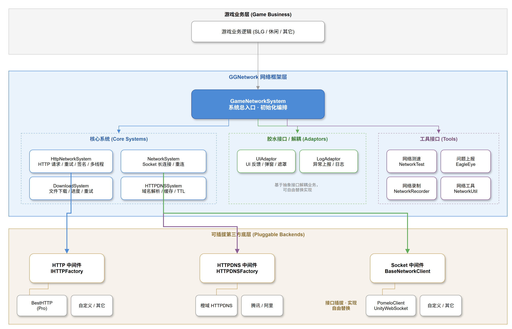

<p align="center">
  <h1 align="center">GGNetwork (内测版)</h1>
  <p align="center">
    <a href="https://github.com/gonglei007/GGFramework-GGNetwork/watchers" target="_blank"></a>
    <a href="https://github.com/gonglei007/GGFramework-GGNetwork/stargazers" target="_blank"></a>
    <a href="https://github.com/gonglei007/GGFramework-GGNetwork/network/members" target="_blank"></a>
    
    <a href="https://github.com/gonglei007/GGFramework-GGNetwork/graphs/contributors" target="_blank"></a>
  </p>
  <p align="center">面向游戏客户端的可插拔网络框架 —— 内置异常重试 / 断线重连 / HttpDNS / 异常上报，HTTP、Socket、域名解析底层均可自由替换。</p>
</p>


## 快速开始

复制框架与依赖目录到你的工程，初始化后即可发请求：

```csharp
using GGFramework.GGNetwork;

// 1. 复制 GGNetwork/Assets/Scripts/GGNetwork/ 与 Dependency/ 到你的工程
// 2. 初始化（启动时调用一次）
NetworkConst.InitEx(secretKey: "your-key", deviceUID: SystemInfo.deviceUniqueIdentifier,
    channel: "google-play", clientVersion: Application.version);
GameNetworkSystem.Instance.Init();

// 3. 发请求
JsonObject param = new JsonObject();
param["username"] = "player1";
HttpNetworkSystem.Instance.PostWebRequest("http://api.example.com", "/user/login",
    param, HttpNetworkSystem.ExceptionAction.ConfirmRetry,
    (JsonObject response) => Debug.Log(response.ToString()));
```

> 完整接入流程见 [如何快速接入?](/documents/quickstart.md) 与 [技术手册](/documents/manual.md)

## 简介

> 它不是一个网络功能的底层实现，它封装了游戏客户端所需的一些网络特性，让游戏网络的稳定性和体验感更好。并且可以很方便地挂载第三方或者自定义的网络底层模块。

框架面向不同业务层级的功能划分：

* **游戏业务层** — 交给游戏业务开发环节处理
* **游戏网络层** — 框架提供异常检查与处理
* **网络通信层** — 框架提供异常检查与处理

### 目标

为游戏客户端提供：

* 更好的网络稳定性
* 更好的网络交互体验

## 功能与特性

**网络交互体验**

- 支持 UI 反馈回调挂载，接入简单，当网络连接、请求发生异常或等待时，获得更好的交互体验
- 支持多线程请求，避免网络卡顿对 UI 产生影响
- 支持请求异常响应，例如失败后自动重试、手动重试、忽略等
- 支持断线重连，包括自动重连、手动重连

**网络质量保障**

- 支持 HttpDNS，避免玩家端的 DNS 劫持
- 支持网络异常上报，让开发者了解分布各地的玩家的网络状况

**第三方支持**

- 支持 **HTTP/HTTPS 连接**（已实现）：预置 `Best HTTP (Pro)` 作为底层；也可挂载自定义或其它第三方 HTTP 模块
- 支持 **Socket / 长连接**（已实现，内测）：预置基于 WebSocket + Pomelo 协议的 `PomeloClient`；也可挂载自定义或其它第三方长连接模块
- 支持 **HttpDNS Provider 插拔**：预置橙域实现，工厂预留腾讯、阿里

> **可插拔设计**：框架通过 `IHTTPFactory`（HTTP 底层）、`BaseNetworkClient`（长连接底层）、`UIAdaptor`/`LogAdaptor`（UI 与上报解耦）、`HTTPDNSFactory`（域名解析）等抽象接口，将各类底层实现与业务解耦，可自由替换或挂载第三方实现。

## 工程内容

<table>
    <tr><th>目录</th><th>内容</th><th>说明</th></tr>
    <tr>
        <td>GGNetwork/Assets/Scripts/GGNetwork</td>
        <td>框架代码</td>
        <td>可以直接复制到目标工程中使用。</td>
    </tr>
    <tr>
        <td>GGNetwork/Assets/Demo</td>
        <td>演示工程</td>
        <td>可以作为框架使用的参考。</td>
    </tr>
</table>

## 核心模块

| 模块 | 说明 |
| ---- | ---- |
| `GameNetworkSystem` | 系统总入口，按固定顺序完成整体初始化编排 |
| `HttpNetworkSystem` | HTTP 层总入口：`Post/Get` 请求、异常处理策略、参数签名、多线程、结果统一分发 |
| `NetworkSystem` | 长连接总入口：客户端连接管理（默认 game / notify 两条）、请求发送、轮询刷新 |
| `DownloadSystem` | 文件下载管理：流式下载、进度回调、失败自动重试 |
| `HTTPDNSSystem` | 域名解析：本地缓存、TTL 定时刷新、按 IP 替换 host |
| `ServiceCenter` | 网络服务中心：连接/请求超时参数、服务域名动态刷新 |

## 架构



## 文档

* [如何快速接入?](/documents/quickstart.md)
* [技术手册](/documents/manual.md)
* 参考文档(TODO)

## 交流反馈

使用过程中遇到问题、有改进建议，或是想聊聊游戏客户端网络方面的经验，欢迎加入我们：

| 渠道 | 说明 |
| ---- | ---- |
| **QQ 群** `242500383` | [](https://qm.qq.com/cgi-bin/qm/qr?k=fy4Z65nE-5Jd1ay8FkJpDc9iPJyW3d38&jump_from=webapi) 点击加入游戏研发与技术交流群，群内可即时反馈问题 |
| **GitHub Issues** | 提交 bug / 功能建议，点右上角 [New Issue](https://github.com/gonglei007/GGFramework-GGNetwork/issues) |

> 内测期间，你的每一个反馈都在帮助框架变得更好。

## 依赖

* **Best HTTP (Pro)** — HTTP 底层实现（**商业授权资产，不进版本库**，需自行购买导入后使用）
* **PomeloClient / UnityWebSocket** — 长连接底层实现（`Assets/LocalPackages`）
* **GGTask / Dependency** — 多线程任务队列与通用工具程序集

## TODO-List

* 整理代码，把 PomeloClient 充分剥离出来，作为可选插件
* 更完整的 Demo 演示
* 补充架构分层示意图 (mermaid / SVG)

## 更多资料

* [游戏开发图谱](https://github.com/gonglei007/GameDevMind)
  * [客户端网络系统](https://github.com/gonglei007/GameDevMind/blob/main/mds/3.1.4.%E5%AE%A2%E6%88%B7%E7%AB%AF%E7%BD%91%E7%BB%9C%E7%B3%BB%E7%BB%9F.md)
