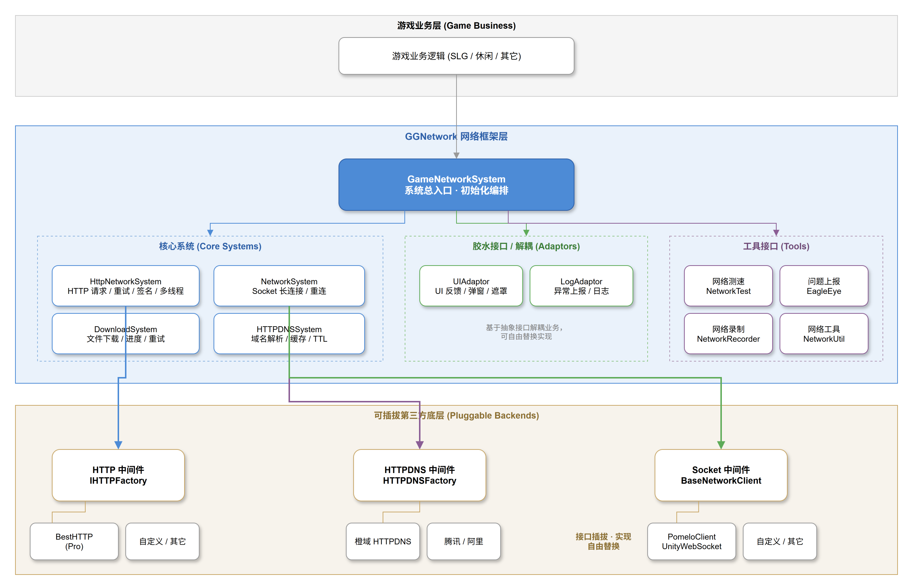
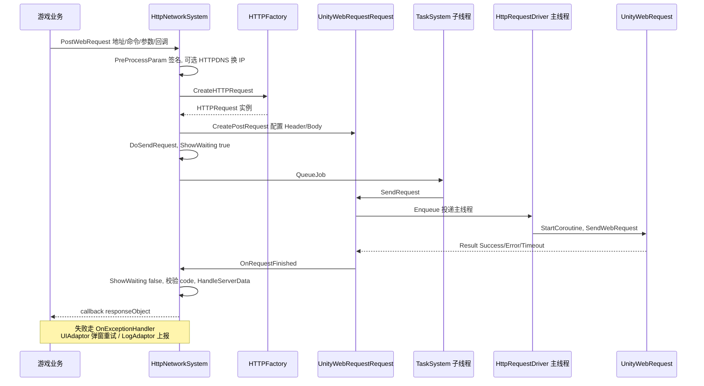
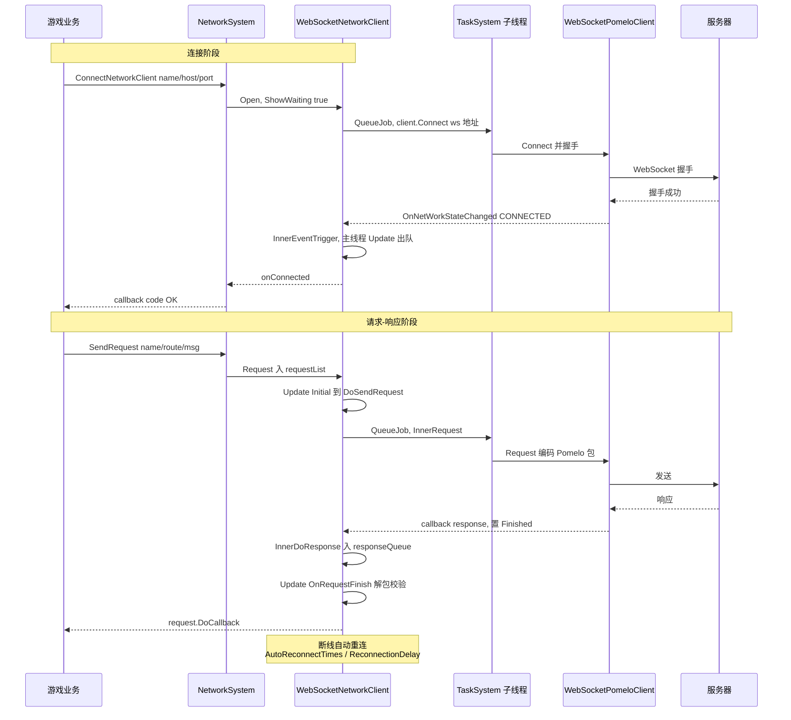
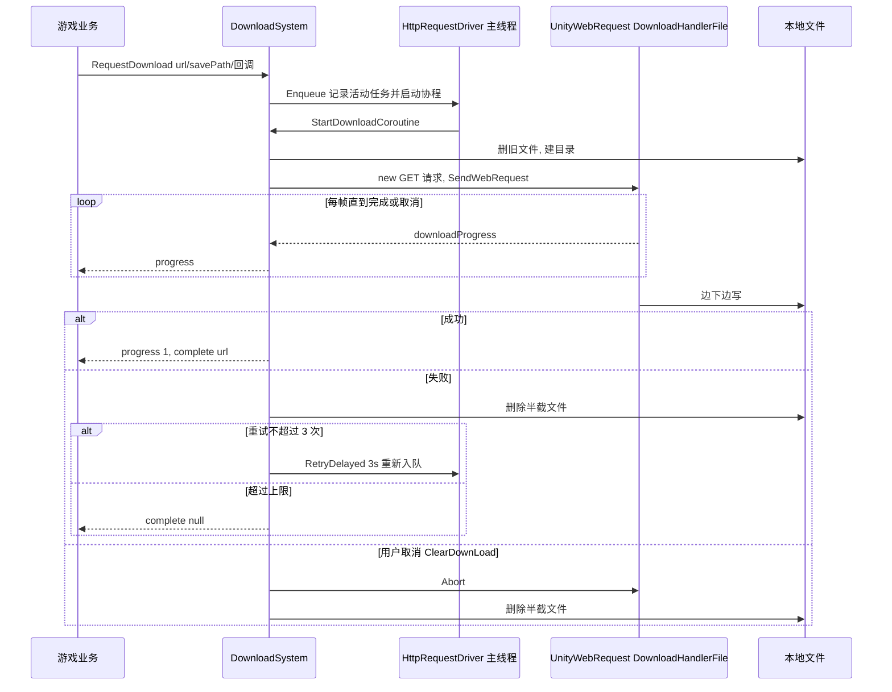

<p align="center">
  <h1 align="center">GGNetwork (内测版)</h1>
  <p align="center">
    <a href="https://github.com/gonglei007/GGFramework-GGNetwork/watchers" target="_blank"></a>
    <a href="https://github.com/gonglei007/GGFramework-GGNetwork/stargazers" target="_blank"></a>
    <a href="https://github.com/gonglei007/GGFramework-GGNetwork/network/members" target="_blank"></a>
    
    <a href="https://github.com/gonglei007/GGFramework-GGNetwork/graphs/contributors" target="_blank"></a>
  </p>
  <p align="center">面向游戏客户端的可插拔网络框架 —— 内置异常重试 / 断线重连 / HttpDNS / 异常上报，HTTP、Socket、域名解析底层均可自由替换。</p>
</p>


## 快速开始

复制框架与依赖目录到你的工程，并在 `Packages/manifest.json` 添加 **GGFramework.Core** 依赖（`#v0.1.1`，基础类单一源），初始化后即可发请求：

```csharp
using GGFramework.GGNetwork;

// 1. 复制 GGNetwork/Assets/Scripts/GGNetwork/ 与 Dependency/ 到你的工程，并添加 GGFramework.Core UPM 依赖（#v0.1.1）
// 2. 初始化（启动时调用一次）
NetworkConst.InitEx(secretKey: "your-key", deviceUID: SystemInfo.deviceUniqueIdentifier,
    channel: "google-play", clientVersion: Application.version);
GameNetworkSystem.Instance.Init();

// 3. 发请求
JsonObject param = new JsonObject();
param["username"] = "player1";
HttpNetworkSystem.Instance.PostWebRequest("http://api.example.com", "/user/login",
    param, HttpNetworkSystem.ExceptionAction.ConfirmRetry,
    (JsonObject response) => Debug.Log(response.ToString()));
```

> 完整接入流程见 [如何快速接入?](/documents/quickstart.md) 与 [技术手册](/documents/manual.md)

## 简介

> 它不是一个网络功能的底层实现，它封装了游戏客户端所需的一些网络特性，让游戏网络的稳定性和体验感更好。并且可以很方便地挂载第三方或者自定义的网络底层模块。

框架面向不同业务层级的功能划分：

* **游戏业务层** — 交给游戏业务开发环节处理
* **游戏网络层** — 框架提供异常检查与处理
* **网络通信层** — 框架提供异常检查与处理

### 目标

为游戏客户端提供：

* 更好的网络稳定性
* 更好的网络交互体验

## 功能与特性

**网络交互体验**

- 支持 UI 反馈回调挂载，接入简单，当网络连接、请求发生异常或等待时，获得更好的交互体验
- 支持多线程请求，避免网络卡顿对 UI 产生影响
- 支持请求异常响应，例如失败后自动重试、手动重试、忽略等
- 支持断线重连，包括自动重连、手动重连

**网络质量保障**

- 支持 HttpDNS，避免玩家端的 DNS 劫持
- 支持网络异常上报，让开发者了解分布各地的玩家的网络状况

**第三方支持**

- 支持 **HTTP/HTTPS 连接**（已实现）：默认使用 **Unity 原生 `UnityWebRequest`** 作为 HTTP 底层（内部实现，具备超时/Header 注入/状态映射/异常上报，`HttpNetworkSystem.UseUnityWebRequest` 可回退）；也可挂载自定义或其它第三方 HTTP 模块
- 支持 **Socket / 长连接**（已实现）：**内置**基于 WebSocket + Pomelo 协议的客户端（`GGFramework.GGNetwork.Socket.WebSocket`，传输层用 `ClientWebSocket`，应用层内化握手/心跳/请求-响应/推送路由）；可通过 `BaseNetworkClient` 挂载其它第三方长连接模块，并保留 TCP 版 `PomeloClient` 作为可切换回退（`NetworkSystem.UseWebSocket=false`）
- 支持 **HttpDNS Provider 插拔**：预置橙域实现，工厂预留腾讯、阿里

> **可插拔设计**：框架通过 `IHTTPFactory`（HTTP 底层）、`BaseNetworkClient`（长连接底层）、`UIAdaptor`/`LogAdaptor`（UI 与上报解耦）、`HTTPDNSFactory`（域名解析）等抽象接口，将各类底层实现与业务解耦，可自由替换或挂载第三方实现。

## 工程内容

<table>
    <tr><th>目录</th><th>内容</th><th>说明</th></tr>
    <tr>
        <td>GGNetwork/Assets/Scripts/GGNetwork</td>
        <td>框架代码</td>
        <td>可以直接复制到目标工程中使用。</td>
    </tr>
    <tr>
        <td>GGNetwork/Assets/Demo</td>
        <td>演示工程</td>
        <td>可以作为框架使用的参考。</td>
    </tr>
</table>

## 核心模块

| 模块 | 说明 |
| ---- | ---- |
| `GameNetworkSystem` | 系统总入口，按固定顺序完成整体初始化编排 |
| `HttpNetworkSystem` | HTTP 层总入口：`Post/Get` 请求、异常处理策略、参数签名、多线程、结果统一分发 |
| `NetworkSystem` | 长连接总入口：客户端连接管理（默认 game / notify 两条）、请求发送、轮询刷新 |
| `DownloadSystem` | 文件下载管理：Unity 原生 `DownloadHandlerFile` 边下边写、进度/总大小回调、失败自动重试 |
| `HTTPDNSSystem` | 域名解析：本地缓存、TTL 定时刷新、按 IP 替换 host |
| `ServiceCenter` | 网络服务中心：连接/请求超时参数、服务域名动态刷新 |

## 架构



### 关键流程时序图

以下三张时序图按源码核实绘制，涵盖框架三条核心链路：HTTP 请求（多线程 + 主线程调度）、WebSocket 长连接与请求-响应、文件下载（边下边写 + 失败重试）。图以 **mermaid** 内嵌维护（GitHub 原生渲染），格式约定见 GGFramework-Docs `architecture/architecture-diagram.md` §5。

#### HTTP 请求

`HttpNetworkSystem` 在子线程（`TaskSystem`）发起，但 `UnityWebRequest` 必须主线程创建与发送，因此经 `HttpRequestDriver` 把发送协程投递回主线程，完成后统一由 `OnRequestFinished` 分发成功/错误/超时。


```mermaid
sequenceDiagram
    participant Biz as 游戏业务
    participant HNS as HttpNetworkSystem
    participant Fac as HTTPFactory
    participant Req as UnityWebRequestRequest
    participant TS as TaskSystem 子线程
    participant Drv as HttpRequestDriver 主线程
    participant UWR as UnityWebRequest

    Biz->>HNS: PostWebRequest 地址/命令/参数/回调
    HNS->>HNS: PreProcessParam 签名, 可选 HTTPDNS 换 IP
    HNS->>Fac: CreateHTTPRequest
    Fac-->>HNS: HTTPRequest 实例
    HNS->>Req: CreatePostRequest 配置 Header/Body
    HNS->>HNS: DoSendRequest, ShowWaiting true
    HNS->>TS: QueueJob
    TS->>Req: SendRequest
    Req->>Drv: Enqueue 投递主线程
    Drv->>UWR: StartCoroutine, SendWebRequest
    UWR-->>Req: Result Success/Error/Timeout
    Req->>HNS: OnRequestFinished
    HNS->>HNS: ShowWaiting false, 校验 code, HandleServerData
    HNS-->>Biz: callback responseObject
    Note over HNS,Biz: 失败走 OnExceptionHandler<br/>UIAdaptor 弹窗重试 / LogAdaptor 上报
```

#### WebSocket 长连接与请求

`NetworkSystem` 管理多条 `BaseNetworkClient`（默认 `game` / `notify`）。连接与请求均在子线程发起，事件经内部队列在主线程 `Update` 出队回调；断线时按 `AutoReconnectTimes` / `ReconnectionDelay` 自动重连。


```mermaid
sequenceDiagram
    participant Biz as 游戏业务
    participant NS as NetworkSystem
    participant Cli as WebSocketNetworkClient
    participant TS as TaskSystem 子线程
    participant Ws as WebSocketPomeloClient
    participant Srv as 服务器

    Note over Biz,Cli: 连接阶段
    Biz->>NS: ConnectNetworkClient name/host/port
    NS->>Cli: Open, ShowWaiting true
    Cli->>TS: QueueJob, client.Connect ws 地址
    TS->>Ws: Connect 并握手
    Ws->>Srv: WebSocket 握手
    Srv-->>Ws: 握手成功
    Ws-->>Cli: OnNetWorkStateChanged CONNECTED
    Cli->>Cli: InnerEventTrigger, 主线程 Update 出队
    Cli-->>NS: onConnected
    NS-->>Biz: callback code OK

    Note over Biz,Srv: 请求-响应阶段
    Biz->>NS: SendRequest name/route/msg
    NS->>Cli: Request 入 requestList
    Cli->>Cli: Update Initial 到 DoSendRequest
    Cli->>TS: QueueJob, InnerRequest
    TS->>Ws: Request 编码 Pomelo 包
    Ws->>Srv: 发送
    Srv-->>Ws: 响应
    Ws-->>Cli: callback response, 置 Finished
    Cli->>Cli: InnerDoResponse 入 responseQueue
    Cli->>Cli: Update OnRequestFinish 解包校验
    Cli-->>Biz: request.DoCallback
    Note over Cli: 断线自动重连<br/>AutoReconnectTimes / ReconnectionDelay
```

#### 文件下载

`DownloadSystem` 基于 `UnityWebRequest` + `DownloadHandlerFile` 边下边写本地文件（不占内存），同样经 `HttpRequestDriver` 投递主线程启动协程；失败删半截文件并延迟 3 秒重试（最多 3 次），`ClearDownLoad` 可取消。


```mermaid
sequenceDiagram
    participant Biz as 游戏业务
    participant DS as DownloadSystem
    participant Drv as HttpRequestDriver 主线程
    participant UWR as UnityWebRequest DownloadHandlerFile
    participant Disk as 本地文件

    Biz->>DS: RequestDownload url/savePath/回调
    DS->>Drv: Enqueue 记录活动任务并启动协程
    Drv->>DS: StartDownloadCoroutine
    DS->>Disk: 删旧文件, 建目录
    DS->>UWR: new GET 请求, SendWebRequest
    loop 每帧直到完成或取消
        UWR-->>DS: downloadProgress
        DS-->>Biz: progress
    end
    UWR->>Disk: 边下边写
    alt 成功
        DS-->>Biz: progress 1, complete url
    else 失败
        DS->>Disk: 删除半截文件
        alt 重试不超过 3 次
            DS->>Drv: RetryDelayed 3s 重新入队
        else 超过上限
            DS-->>Biz: complete null
        end
    else 用户取消 ClearDownLoad
        DS->>UWR: Abort
        DS->>Disk: 删除半截文件
    end
```

## 文档

* [如何快速接入?](/documents/quickstart.md)
* [技术手册](/documents/manual.md)
* 参考文档(TODO)

## 交流反馈

使用过程中遇到问题、有改进建议，或是想聊聊游戏客户端网络方面的经验，欢迎加入我们：

| 渠道 | 说明 |
| ---- | ---- |
| **QQ 群** `242500383` | [](https://qm.qq.com/cgi-bin/qm/qr?k=fy4Z65nE-5Jd1ay8FkJpDc9iPJyW3d38&jump_from=webapi) 点击加入游戏研发与技术交流群，群内可即时反馈问题 |
| **GitHub Issues** | 提交 bug / 功能建议，点右上角 [New Issue](https://github.com/gonglei007/GGFramework-GGNetwork/issues) |

> 内测期间，你的每一个反馈都在帮助框架变得更好。

## 依赖

| 依赖 | 性质 | 说明 / 获取方式 |
| ---- | ---- | ---- |
| **Unity Web Request** | 内置（默认） | HTTP 底层**默认内置** Unity 原生实现（传输层用 `UnityEngine.Networking.UnityWebRequest`，见 `Scripts/GGNetwork/HTTP`），不依赖第三方 HTTP 库 |
| **Best HTTP (Pro)** | 可选（第三方适配） | 原 HTTP 底层，已迁移；如需回退可选购导入后经 `HttpNetworkSystem.UseUnityWebRequest=false` 启用，见下方"获取 Best HTTP (Pro)" |
| **PomeloClient / UnityWebSocket** | 内置（回退） | 长连接**默认已内置内部 WebSocket 实现**（`Scripts/GGNetwork/Socket/WebSocket`）；外部 TCP 版 `PomeloClient` 仅作可选回退底层（`Assets/LocalPackages`，`NetworkSystem.UseWebSocket=false` 时启用） |
| **GGFramework.Core** | UPM（必需） | `Singleton` / `CoroutineUtil` / `TaskSystem`（`GTask`）的单一源，经 UPM git URL 引用 `#v0.1.1`；工程内本地副本已删除 |
| **Dependency/Utils** | 内置 | `GameDebugger` / `ZipUtil` 等通用工具（`Singleton` / `CoroutineUtil` / `TaskSystem` 已移至 GGFramework.Core） |

### 获取 Best HTTP (Pro)

Best HTTP (Pro) 是付费商业插件，出于许可协议考虑**不随仓库分发**。使用前需：

1. 从 [Asset Store - Best HTTP (Pro)](https://assetstore.unity.com/packages/tools/network/best-http-2-187279) 或 [官方商店](https://besthttp.net/) 购买并下载
2. 将插件导入到 `GGNetwork/Assets/LocalPackages/Best HTTP (Pro)/`
3. 确认与框架引用的版本匹配（框架已适配其公开 API）

> **说明**：框架 HTTP 层与下载系统均已默认使用 **Unity 原生实现**，无需 Best HTTP (Pro) 即可运行。Best HTTP (Pro) 现为**可选回退**（`HttpNetworkSystem.UseUnityWebRequest=false` 时启用）；也可通过 `IHTTPFactory` 挂载其它第三方 HTTP 实现。

## TODO-List

* ~~把 PomeloClient 充分剥离出来，作为可选插件~~（已实现：内置 WebSocket + Pomelo 内部实现 `GGFramework.GGNetwork.Socket.WebSocket`，已作为默认长连接底层；`NetworkSystem.UseWebSocket` 可回退 TCP）
* 更完整的 Demo 演示（含 WebSocket 长连接联机示例）
* ~~补充架构分层示意图 (mermaid / SVG)~~（已补充：README 「关键流程时序图」新增 HTTP / WebSocket / 下载三张 mermaid 时序图）

## 更多资料

* [游戏开发图谱](https://github.com/gonglei007/GameDevMind)
  * [客户端网络系统](https://github.com/gonglei007/GameDevMind/blob/main/mds/3.1.4.%E5%AE%A2%E6%88%B7%E7%AB%AF%E7%BD%91%E7%BB%9C%E7%B3%BB%E7%BB%9F.md)
